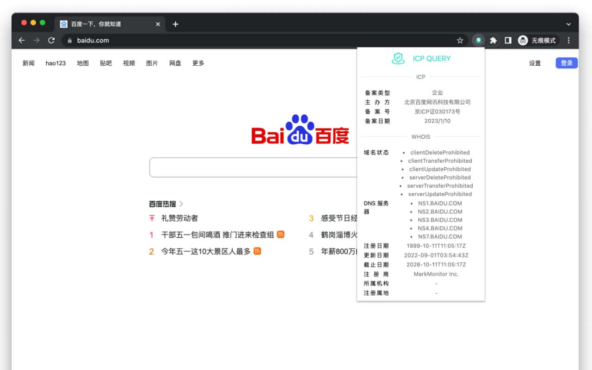
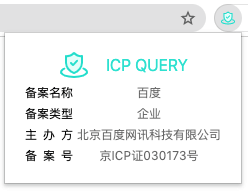
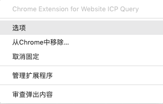
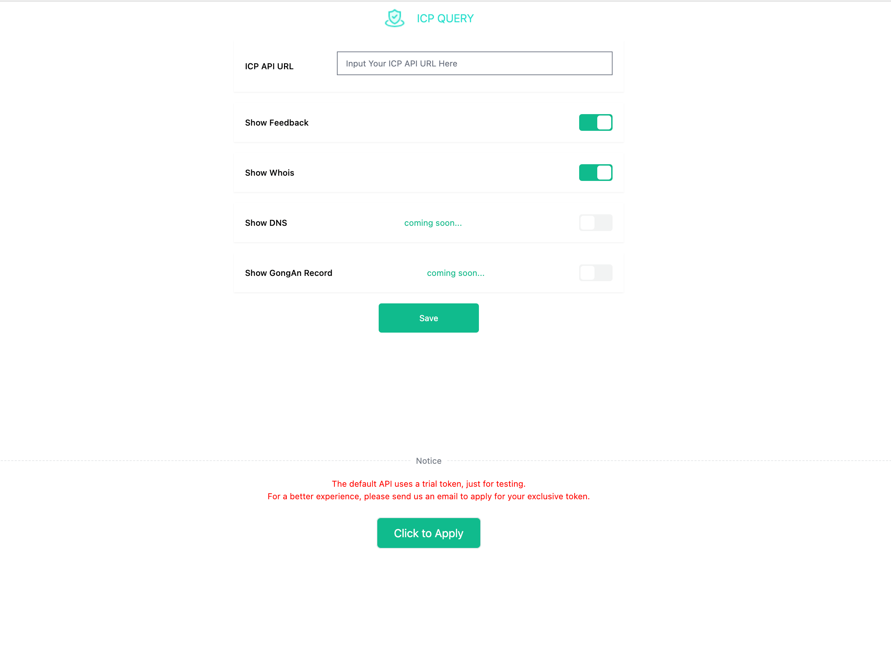

<p align="center">
  
</p>
<p align="center">
Browser Extension for ICP、DNS、Whois & GEO Query
</p>
<p align="center">
<a href="https://github.com/yuedanlabs/icp-query-extension/blob/main/LICENSE"></a>
</p>

[English](README.md) | [简体中文](README.zh-Hans.md)

## 简介

ICP Query Extension 是一个开源的浏览器扩展,用于:

  - ICP 查询
  - DNS 查询
  - Whois 查询
  - 服务器位置和 ISP 查找

## 安装

1. [Chrome 应用商店](https://chrome.google.com/webstore/detail/icp-query-extension/plmfnmaihcmijdanpbondfejclejejfa): 直接从 Chrome 商店安装。 **推荐 👈**
2. [发布的源代码](https://github.com/yuedanlabs/icp-query-extension/releases): 下载 zip 发布包进行手动安装。
3. 从源代码构建，流程见下面

## 图像演示

仅在点击扩展图标时显示当前标签页域名的 ICP 等信息，也仅仅只需一点。

<p align="center">
  
  <br>
  (0. Main Page)
</p>
<p align="center">
  
  <br>
  (1. Main Page)
</p>
<p align="center">
  
  <br>
  (2. Main Page with no API)
</p>
<p align="center">
  
  <br>
  (3. Options Page)
</p>
<p align="center">
  
  <br>
  (4. Options Page)
</p>

## 源码构建

- 从 [源代码](https://github.com/yuedanlabs/icp-query-extension.git) 构建拓展
  1. 克隆本仓库代码到本地机器
      ```bash
      $ git clone https://github.com/yuedanlabs/icp-query-extension.git
      ```
  2. 构建拓展
      ```bash
      $ cd icp-query-extension
      $ pnpm install
      $ pnpm run build
      ```
      然后可以在 `build/chrome-mv3-prod` 目录下查看dist文件,在Chrome中使用。
  3. 安装扩展程序
      - 在Chrome浏览器中打开 `chrome://extensions/`
      - 在右上角打开 `开发者模式`
      - 点击 `加载已解压的扩展程序` 按钮
      - 选择 `icp-query-extension/build/chrome-mv3-prod` 文件夹
      - 点击 `选择` 按钮
      - 如有需要，将拓展 `固定` 在工具栏
      - 如有需要，在 `选项` 页面设置API URL
  4. 尽情享受独属于你的快乐时光

## 赞助商

<!-- Fill in the list of sponsors here -->

<a href="https://github.com/labring/laf"></a>

## 关于 API

该扩展程序所使用的 API 是独立且可扩展的。任何符合以下数据结构的 API 都可以应用于此扩展程序：

- API URL

  API 需要一个 `url` 查询参数:
    - url: 要查询的域名

  示例：
    - `https://your-domain/release/icp?url=www.baidu.com`

- API 响应数据

  - API V2
  ```json
  {
    "icp": {
      "subject": {
        "name": "北京百度网讯科技有限公司",
        "nature": "企业",
        "license": "京ICP证030173号",
        "updateTime": "2023-05-29 08:20:36"
      },
      "website": {
        "domain": "baidu.com",
        "license": "京ICP证030173号-1"
      }
    },
    "whois": {
      "Domain Status": [
        "clientDeleteProhibited https://icann.org/epp#clientDeleteProhibited",
        "clientTransferProhibited https://icann.org/epp#clientTransferProhibited",
        "clientUpdateProhibited https://icann.org/epp#clientUpdateProhibited",
        "serverDeleteProhibited https://icann.org/epp#serverDeleteProhibited",
        "serverTransferProhibited https://icann.org/epp#serverTransferProhibited",
        "serverUpdateProhibited https://icann.org/epp#serverUpdateProhibited"
      ],
      "Name Server": [
        "NS1.BAIDU.COM",
        "NS2.BAIDU.COM",
        "NS3.BAIDU.COM",
        "NS4.BAIDU.COM",
        "NS7.BAIDU.COM"
      ],
      "Created Date": "1999-10-11T11:05:17Z",
      "Updated Date": "2022-09-01T03:54:43Z",
      "Expiry Date": "2026-10-11T11:05:17Z",
      "Registrar": "MarkMonitor Inc."
    },
    "dns": {
      "A": [
        "180.101.50.242",
        "180.101.50.188"
      ],
      "AAAA": [],
      "CNAME": [
        "www.a.shifen.com"
      ],
      "NS": [],
      "GEO": {
        "isp": "电信",
        "area": "中国 江苏 南京"
      }
    }
  }
  ```

  - API V1
  ```json
  [
    {
      "subject": {
        "name": "北京百度网讯科技有限公司",
        "nature": "企业",
        "license": "京ICP证030173号",
        "updateTime": "2023-01-10 09:43:35"
      },
      "website": {
        "domain": "baidu.com",
        "license": "京ICP证030173号-1"
      },
      "whois": {
        "Domain Status": [
          "clientDeleteProhibited https://icann.org/epp#clientDeleteProhibited",
          "clientTransferProhibited https://icann.org/epp#clientTransferProhibited",
          "clientUpdateProhibited https://icann.org/epp#clientUpdateProhibited",
          "serverDeleteProhibited https://icann.org/epp#serverDeleteProhibited",
          "serverTransferProhibited https://icann.org/epp#serverTransferProhibited",
          "serverUpdateProhibited https://icann.org/epp#serverUpdateProhibited"
        ],
        "Name Server": [
          "NS1.BAIDU.COM",
          "NS2.BAIDU.COM",
          "NS3.BAIDU.COM",
          "NS4.BAIDU.COM",
          "NS7.BAIDU.COM"
        ],
        "Created Date": "1999-10-11T11:05:17Z",
        "Updated Date": "2022-09-01T03:54:43Z",
        "Expiry Date": "2026-10-11T11:05:17Z",
        "Registrar": "MarkMonitor Inc."
      },
      "dns": {
        "A": ["110.242.68.66", "39.156.66.10"],
        "AAAA": [],
        "CNAME": [],
        "NS": [
          "ns3.baidu.com",
          "dns.baidu.com",
          "ns4.baidu.com",
          "ns7.baidu.com",
          "ns2.baidu.com"
        ],
        "GEO": {
          "isp": "中国移动",
          "area": "中国 北京市 北京市"
        }
      }
    }
  ]
  ```

## 待办事项

- [x] whois
- [x] DNS
- [ ] GongAn Record
- [x] GEO & ISP
- [ ] Other domains under the same subject
- [ ] Options API and custom API

## 许可证

[License MIT](LICENSE)